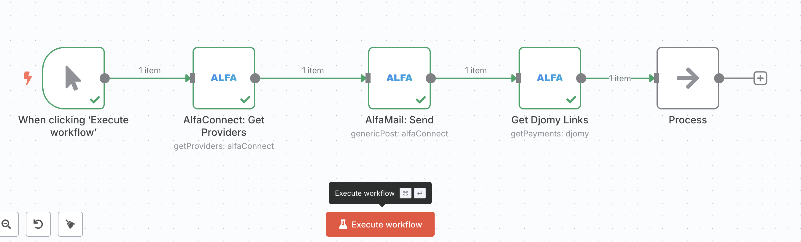

# n8n-nodes-alfaconnect

This is an n8n community node. It lets you use AlfaConnect in your n8n workflows.

AlfaConnect is a unified gateway that connects your applications to multiple service providers. Process payments, send emails, deliver SMS, and interact with AI models through a single powerful API available at [https://alfaconnect.io](https://alfaconnect.io).

[n8n](https://n8n.io/) is a [fair-code licensed](https://docs.n8n.io/reference/license/) workflow automation platform.

[Installation](#installation)  
[Operations](#operations)  
[Credentials](#credentials)  
[Use Cases](#use-cases)  
[Compatibility](#compatibility)  
[Resources](#resources)  

## Installation

Follow the [installation guide](https://docs.n8n.io/integrations/community-nodes/installation/) in the n8n community nodes documentation.

## Operations

This node supports multiple resources and operations:

### AlfaConnect Resource
- **Generic Get**: Make custom GET requests to any AlfaConnect API endpoint
- **Generic Post**: Make custom POST requests with JSON payload to any AlfaConnect API endpoint  
- **Get Providers**: Retrieve the list of available service providers

### AlfaMail Resource
- **Send Mail**: Send emails through AlfaConnect's email service providers

### Djomy Resource  
- **Get Payments**: Retrieve the list of payments and their status

### NimbaSMS Resource
- **Get Balance**: Check SMS balance for NimbaSMS service
- **Send SMS**: Send SMS messages through NimbaSMS provider

## Credentials

To use this node, you need to authenticate with the AlfaConnect API:

1. **Sign up** for an AlfaConnect account at [https://alfaconnect.io](https://alfaconnect.io)
2. **Get your API credentials** from the AlfaConnect dashboard
3. **Configure the credentials** in n8n:
   - **Client ID**: Your AlfaConnect client identifier (`x-alfa-client-id`)
   - **Secret ID**: Your AlfaConnect secret key (`x-alfa-secret-id`)

The node uses header-based authentication with your AlfaConnect API credentials.

## Use Cases

Here are some practical examples of how you can use the AlfaConnect node in your n8n workflows:

### 🚀 **E-commerce Order Processing**
Create a complete order fulfillment workflow:
1. **Trigger**: New order received (webhook/database)
2. **Payment**: Use Djomy to process payment and verify status
3. **Notification**: Send order confirmation email via AlfaMail
4. **SMS Alert**: Notify customer via NimbaSMS when order ships
5. **Custom Integration**: Use Generic Post to update inventory systems

### 📧 **Customer Communication Hub**
Automate multi-channel customer communications:
1. **Trigger**: Customer support ticket created
2. **Email**: Send acknowledgment email through AlfaMail
3. **SMS**: Send urgent notifications via NimbaSMS
4. **Custom Data**: Use Generic Get to fetch customer preferences
5. **Follow-up**: Schedule automated follow-up communications

### 💰 **Payment and Billing Automation**
Streamline payment processing workflows:
1. **Trigger**: Invoice due date approaching
2. **Payment Check**: Use Djomy to check payment status
3. **Reminder**: Send payment reminder via AlfaMail or NimbaSMS
4. **Custom Logic**: Use Generic Post to update billing systems
5. **Reporting**: Aggregate payment data for analytics

### 🔧 **API Integration and Monitoring**
Monitor and interact with AlfaConnect services:
1. **Scheduled Trigger**: Run health checks every hour
2. **Service Check**: Use Generic Get to check service status
3. **Provider Info**: Get available providers and their status
4. **Alert System**: Send SMS alerts for service issues via NimbaSMS
5. **Custom Reporting**: Post metrics to external monitoring systems

### 📱 **Marketing Campaign Automation**
Create targeted marketing workflows:
1. **Trigger**: Customer segment updated
2. **Email Campaign**: Send personalized emails via AlfaMail
3. **SMS Blast**: Follow up with SMS messages through NimbaSMS
4. **Payment Links**: Generate payment links using Djomy
5. **Analytics**: Track campaign performance with custom API calls

### 🛠 **Developer and DevOps Workflows**
Integrate AlfaConnect with development processes:
1. **Deployment Trigger**: Code deployed to production
2. **Notification**: Send deployment notifications via AlfaMail
3. **Status Check**: Use Generic Get to verify service health
4. **Alert Team**: Send critical alerts via NimbaSMS
5. **Custom Integration**: Post deployment data to monitoring tools

## Compatibility

- **Minimum n8n version**: 1.0.0
- **Tested with n8n versions**: 1.97.1
- **Node version**: Requires Node.js 18 or higher

## Resources

- [n8n community nodes documentation](https://docs.n8n.io/integrations/#community-nodes)
- [AlfaConnect Platform Documentation](https://alfaconnect.io)
- [AlfaConnect API Documentation](https://api.alfaconnect.io)
- [GitHub Repository](https://github.com/AlfaConnect-io/n8n-nodes-alfaconnect)
